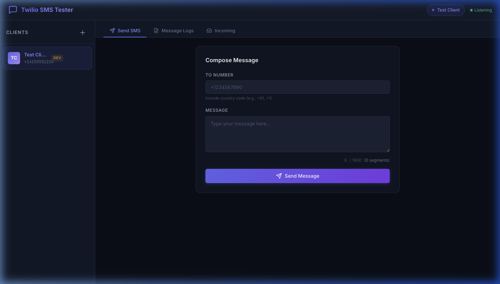

# Twilio SMS Tester ⚡

A standalone developer tool for testing Twilio SMS across multiple client accounts — no more juggling the Twilio dashboard.



## Why?

When building SMS features for clients, testing is painful:
- 🔁 Switching between Twilio accounts to check logs
- 📋 Using the "Try SMS" dashboard page to send test messages
- 🔍 Digging through the console to find specific messages

**This tool puts everything in one place.** Add your clients' Twilio credentials, send messages, view logs, and monitor incoming SMS — all in a single app.

## Features

| Feature | Description |
|---|---|
| 🏢 **Multi-Client** | Store multiple Twilio accounts. Switch between them in one click |
| 📤 **Send SMS** | Compose and send test messages to any number |
| 📋 **Message Logs** | View sent/received messages pulled from Twilio API |
| 📥 **Incoming SMS** | Real-time incoming message feed via webhook + SSE |
| 🔒 **Encrypted Storage** | Auth tokens encrypted (AES-256-CBC) in local JSON |
| 🔎 **Message Details** | Click any message to see full details (SID, price, errors) |
| 📱 **Number Scoped** | Logs and messages are scoped to the client's specific Twilio number |

## Quick Start

### Prerequisites
- [Node.js](https://nodejs.org/) v16 or higher
- A [Twilio](https://www.twilio.com/) account (free trial works)

### Setup

```bash
# Clone the repo
git clone https://github.com/hardikdevmurari/twilio-sms-tester.git
cd twilio-sms-tester

# Install dependencies
npm install

# Set up environment
cp .env.example .env
# Edit .env and set your own ENCRYPTION_KEY (any 32-char string)

# Start the app
npm run dev
```

Open [http://localhost:3456](http://localhost:3456) in your browser.

### First Steps

1. Click **+** to add a client
2. Enter their **Account SID**, **Auth Token**, and **Twilio Phone Number** (find these in the [Twilio Console](https://console.twilio.com/))
3. Click **Save** — you're ready to test!

## Usage

### Send SMS
Select a client → **Send SMS** tab → enter the destination number and message → **Send**.

### View Logs
Select a client → **Message Logs** tab → click **Refresh** to pull logs from Twilio. Click any row for full details.

### Incoming Messages
For real-time incoming SMS, you need to expose your local server with a tunnel:

```bash
# Using ngrok (recommended)
ngrok http 3456

# Copy the HTTPS URL, then in the app:
# Go to "Incoming" tab → Click "Copy Webhook URL"
```

Set the webhook URL in your [Twilio Console](https://console.twilio.com/) → Phone Numbers → Your Number → Messaging → "A message comes in" → Paste the URL:

```
https://your-ngrok-id.ngrok.io/api/sms/webhook/incoming
```

## Configuration

| Variable | Default | Description |
|---|---|---|
| `PORT` | `3456` | Server port |
| `ENCRYPTION_KEY` | — | 32-char key for encrypting auth tokens |

## Project Structure

```
twilio-sms-tester/
├── server.js              # Express server
├── routes/
│   ├── clients.js         # Client CRUD API
│   └── sms.js             # SMS send, logs, webhook, SSE
├── utils/
│   └── storage.js         # Encrypted JSON storage
├── public/
│   ├── index.html         # Single-page app
│   ├── css/style.css      # Dark theme UI
│   └── js/app.js          # Frontend logic
├── data/                  # Auto-created, gitignored
│   └── clients.json       # Encrypted client data
├── .env.example           # Environment template
└── package.json
```

## API Reference

### Clients
| Method | Endpoint | Description |
|---|---|---|
| `GET` | `/api/clients` | List all clients (tokens masked) |
| `POST` | `/api/clients` | Add a new client |
| `PUT` | `/api/clients/:id` | Update a client |
| `DELETE` | `/api/clients/:id` | Delete a client |
| `POST` | `/api/clients/:id/verify` | Verify Twilio credentials |

### SMS
| Method | Endpoint | Description |
|---|---|---|
| `POST` | `/api/sms/send` | Send an SMS |
| `GET` | `/api/sms/logs/:clientId` | Fetch message logs |
| `GET` | `/api/sms/message/:clientId/:sid` | Get message details |
| `POST` | `/api/sms/webhook/incoming` | Twilio webhook for incoming SMS |
| `GET` | `/api/sms/incoming/stream` | SSE stream for real-time incoming |
| `GET` | `/api/sms/incoming` | Get stored incoming messages |

## Security

- Auth tokens are **encrypted at rest** using AES-256-CBC before being saved to disk
- Tokens are **masked in API responses** (only last 4 characters shown)
- The `.env` file and `data/` directory are gitignored
- No data is sent to any third-party service — everything stays local

> ⚠️ **Important:** This tool stores Twilio credentials locally. Do not deploy it on a shared or public server without adding proper authentication.

## Tech Stack

- **Backend:** Node.js, Express
- **Frontend:** Vanilla HTML, CSS, JavaScript
- **Storage:** Encrypted local JSON files
- **Real-time:** Server-Sent Events (SSE)
- **Twilio SDK:** Official [twilio-node](https://github.com/twilio/twilio-node)

## Contributing

Contributions are welcome! See [CONTRIBUTING.md](CONTRIBUTING.md) for guidelines.

## License

MIT — see [LICENSE](LICENSE) for details.

---

**Built with ❤️ for developers who are tired of the Twilio dashboard.**
